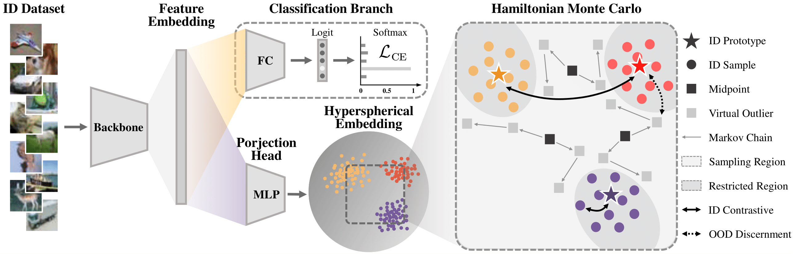

# Outlier Synthesis via Hamiltonian Monte Carlo for Out-of-Distribution Detection

This codebase provides a Pytorch implementation for the paper "Outlier Synthesis via Hamiltonian Monte Carlo for Out-of-Distribution Detection" in ICLR 2025.

## Abstract

Out-of-distribution (OOD) detection is crucial for developing trustworthy and reliable machine learning systems. Recent advances in training with auxiliary OOD data demonstrate efficacy in enhancing detection capabilities. Nonetheless, these methods heavily rely on acquiring a large pool of high-quality natural outliers. Some prior methods try to alleviate this problem by synthesizing virtual outliers but suffer from either poor quality or high cost due to the monotonous sampling strategy and the heavy-parameterized generative models. In this paper, we overcome all these problems by proposing the **Ham**iltonian Monte Carlo **O**utlier **S**ynthesis (**HamOS**) framework, which views the synthesis process as sampling from Markov chains. Based solely on the in-distribution data, the Markov chains can extensively traverse the feature space and generate diverse and representative outliers, hence exposing the model to miscellaneous potential OOD scenarios. The Hamiltonian Monte Carlo with sampling acceptance rate almost close to 1 also makes our framework enjoy great efficiency. By empirically competing with SOTA baselines on both standard and large-scale benchmarks, we verify the efficacy and efficiency of our proposed HamOS.

## Illustration



## Setup

### Environment

1. Set up a virtualenv with python 3.10.9. You can use pyvenv or conda for this.
2. Run ```pip install -r requirements.txt``` to get requirements

### Datasets

Create a data directory as a base for all datasets. The default path to the directory of datasets is ```./data```.

For in-distribution (ID) datatsets, we consider CIFAR-10, CIFAR-100, and ImageNet-1K.

For out-of-distribution (OOD) test datasets, we use MNIST, SVHN, Textures, Places365, LSUN for CIFAR10/100; Textures, Places365, iNaturalist, SUN for ImageNet-1K.


The overall file structure for ```./data``` is as follows:
```
hamos_ood/
└── data/
  ├── benchmark_imglist/
  │ ├── cifar10/
  │ │ ├── test_cifar10.txt
  │ │ ├── test_svhn.txt
  │ │ └── ...
  │ ├── cifar100/
  │ ├── imagenet/
  │ └── ...
  ├── images_classic/
  │ ├── cifar10/
  │ ├── cifar100/
  │ ├── svhn/
  │ └── ...
  └── images_largescale/
    ├── imagenet_1k/
    │ ├── train/
    │ └── val/
    └── ...
```

## Starting an Experiment


### Training

We use bash scripts in ```./scripts``` for running the experiments. The config files in ```./configs``` are used to organize the experiments. For example, if you experiment on the CIFAR-10 dataset, please run:
```
sh scripts/ood/hamos/train/cifar10_train_hamos.sh
```

The experiment results will be placed at ```./results```.

### Evaluation

To evaluate the trained model, please run:
```
sh scripts/ood/hamos/test/cifar10_test_hamos.sh
```

The evaluation results will be placed in corresponding directory in ```./results```.


## Citation

If you find **HamOS** useful or relevant to your research, please kindly cite our paper:

```bibtex
@inproceedings{li2025hamos,
  title={Outlier Synthesis via Hamiltonian Monte Carlo for Out-of-Distribution Detection},
  author={Li, Hengzhuang and Zhang, Teng},
  booktitle={Proceedings of the 13th International Conference on Learning Representations},
  year={2025}
}
```


